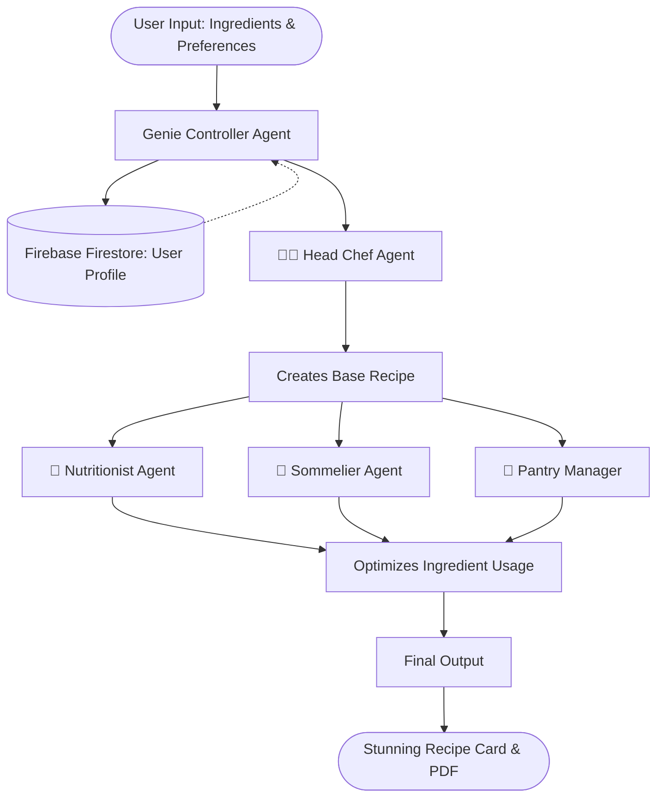

# 🧞‍♂️ MealGenie: Your Multi-Agent AI Kitchen Assistant

<div align="center">
  
</div>

MealGenie is a next-generation, cloud-native web application built with Streamlit and powered by a swarm of specialized AI Agents. Simply tell Genie what ingredients you have, and watch as a team of AI experts—from a Head Chef to a Sommelier—collaborate to generate a stunning, personalized recipe card just for you!

## ✨ Key Features
- **Multi-Agent Architecture**: A synchronized pipeline of AI agents (Chef, Nutritionist, Pantry Manager, Sommelier, and Sustainability Expert) work together to craft the perfect meal.
- **Secure Authentication**: Full login and sign-up capabilities powered by Firebase Authentication.
- **Persistent Cloud Memory**: Uses Firebase Firestore to remember your specific allergies, dietary restrictions, likes, and dislikes across sessions.
- **Dynamic Conversations**: Talk to Genie directly to update your preferences or ask for meal ideas.
- **Export to PDF**: Instantly download your generated recipe card as a beautiful PDF.
- **Premium UI/UX**: Features a modern, glassmorphic dark-mode design with fluid animations.

---

## 🤖 AI Multi-Agent Workflow



---

## 📂 Project Structure
The application follows a professional, modular architecture to separate core business logic, utility functions, and sensitive data.

```text
MealGenie/
  ├── app.py                   # Main Streamlit application entry point
  ├── requirements.txt         # Project dependencies
  ├── .gitignore               # Security exclusions
  ├── agents/                  # AI logic and prompts
  │   ├── chat_controller.py   # Manages conversations and memory extraction
  │   ├── api_client.py        # Connects to the Gemini AI API
  │   └── ...                  # (Chef, Nutritionist, Verifier, etc.)
  ├── core/                    # Core business logic
  │   ├── recipe_gecp_server.py# The main orchestration pipeline
  │   ├── ingredienerator.py   # Legacy generation rules
  │   └── narrator.py          # Adds emojis and fun text
  ├── utils/                   # Helper utilities
  │   ├── firebase_manager.py  # Handles Firebase Auth & Firestore
  │   ├── memory_manager.py    # Interfaces with Firestore for profiles
  │   ├── pdf_generator.py     # Generates downloadable recipe PDFs
  │   ├── security.py          # Input sanitization
  │   └── mnt_parser.py        # Ingredient cleaning and deduplication
  ├── config/                  # (Git-ignored) Secrets and keys
  │   └── firebase_credentials.json 
  └── data/                    # (Git-ignored) Static data and caches
      ├── recipe_cache.db
      └── sample_ingredients.txt
```

---

## 🚀 Installation & Setup

Ready to start cooking with AI? Follow these simple steps to get MealGenie running locally on your machine!

### 1. Clone the repository
Grab the code and move into the project directory:
```bash
git clone https://github.com/yourusername/MealGenie.git
cd MealGenie
```

### 2. Install dependencies
We recommend using a virtual environment. Once activated, install the required packages:
```bash
pip install -r requirements.txt
```

### 3. Configure your Secrets
MealGenie relies on two magical ingredients to work: the Gemini AI and Firebase. Let's keep them safe!
- **Gemini API:** Create a `.env` file in the root directory and securely add your API Key:
  ```env
  GEMINI_API_KEY="your-api-key-here"
  ```
- **Firebase Database:** Download your Firebase Admin SDK Service Account JSON file from your Firebase console. Rename it to `firebase_credentials.json` and place it snugly inside the `config/` folder. *(Don't worry, our `.gitignore` will ensure it never accidentally uploads to GitHub!)*

### 4. Run the Application
Time to fire up the kitchen! Start the Streamlit server:
```bash
streamlit run app.py
```
Open your browser to `http://localhost:8501`, create an account, and start generating recipes!

---

## 🛡️ Security Note
This project utilizes a strict `.gitignore` policy. The `config/` directory, `data/` directory, and `.env` files are explicitly excluded from version control to protect API keys and database credentials from being exposed publicly.
