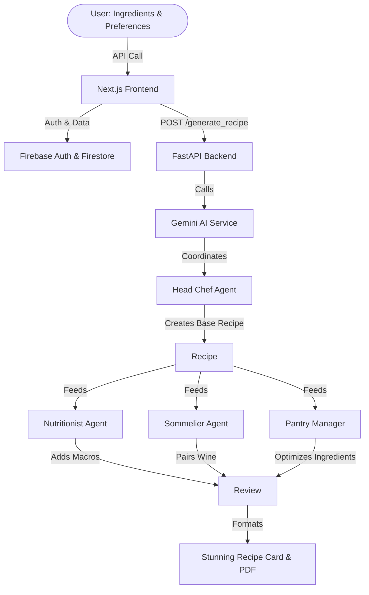

# 🧞‍♂️ MealGenie: Your Multi-Agent AI Kitchen Assistant

<div align="center">
  
</div>

MealGenie is a cutting‑edge, cloud‑native web application that leverages a swarm of specialized AI agents to generate personalized recipes. The new architecture uses a **FastAPI** backend powered by Gemini AI and a **Next.js** (App Router) frontend with a premium glassmorphic design. User authentication and data persistence are handled via **Firebase**.

## ✨ Key Features
- **Multi‑Agent Architecture**: Coordinated AI agents (Head Chef, Nutritionist, Pantry Manager, Sommelier, Sustainability Expert) collaborate to craft optimal meals.
- **Secure Authentication**: Firebase Authentication provides login and sign‑up flows.
- **Persistent Cloud Memory**: User preferences, allergies, and dietary restrictions are stored in Firebase Firestore.
- **Dynamic Conversations**: Chat‑style interaction to tweak preferences or ask for ideas.
- **Export to PDF**: Generate beautifully formatted recipe cards.
- **Premium UI/UX**: Modern glassmorphism, dark mode, fluid animations, and responsive design.

---

## 🧩 Architecture Overview



---

## 🤖 AI Multi‑Agent Workflow

```mermaid
flowchart LR
    subgraph Input
        UI[User Input]
        UI -->|Submit| Frontend[Frontend UI]
    end
    subgraph Preprocess
        Frontend -->|Sanitize & Auth| Auth[Auth Layer]
        Auth -->|Validated Data| Validator[Input Validator]
    end
    subgraph Queue
        Validator -->|Valid| Queue[Task Queue]
        Validator -->|Invalid| Error[Error Handler]
    end
    subgraph Coordination
        Queue -->|Dispatch| Coordinator[Coordinator]
        Coordinator -->|Assign| Chef[Chef Agent]
        Coordinator -->|Assign| Nutritionist[Nutritionist Agent]
        Coordinator -->|Assign| Pantry[Pantry Manager]
        Coordinator -->|Assign| Sommelier[Sommelier Agent]
        Coordinator -->|Assign| Sustainability[Sustainability Agent]
    end
    subgraph Core Processing
        Chef -->|Generate Base| BaseRecipe[Base Recipe]
        Nutritionist -->|Add Macros| MacroEnriched[Macro Enriched]
        Pantry -->|Optimize Ingredients| Optimized[Optimized Ingredients]
        Sommelier -->|Pair Wine| WinePaired[Wine Paired]
        Sustainability -->|Assess Impact| EcoScore[Eco Score]
        BaseRecipe & MacroEnriched & Optimized & WinePaired & EcoScore -->|Combine| Aggregator[Aggregator]
    end
    subgraph Post-Processing
        Aggregator -->|Finalize| Formatter[Formatter & PDF Generator]
        Formatter -->|Persist| Firestore[Firebase Firestore]
        Formatter -->|Return| Frontend
    end
    subgraph Monitoring
        Formatter -->|Metrics| Metrics[Analytics & Metrics]
        Metrics -->|Dashboard| Dashboard[Monitoring Dashboard]
    end
    style Input fill:#2d3748,color:#fff,stroke:#4a5568
    style Preprocess fill:#2c5282,color:#fff,stroke:#63b3ed
    style Queue fill:#4a5568,color:#fff,stroke:#718096
    style Coordination fill:#2b6cb0,color:#fff,stroke:#4299e1
    style Core Processing fill:#38a169,color:#fff,stroke:#68d391
    style Post-Processing fill:#805ad5,color:#fff,stroke:#9f7aea
    style Monitoring fill:#d69e2e,color:#fff,stroke:#f6e05e
```

---

## 📂 Project Structure
```
MealGenie/
├── backend/                     # FastAPI server
│   ├── main.py                 # Application entry point
│   ├── api/
│   │   └── routes.py          # Recipe generation endpoint
│   └── requirements.txt        # Backend dependencies
│
├── frontend/                    # Next.js application (App Router)
│   ├── src/
│   │   ├── app/
│   │   │   ├── layout.tsx      # Global layout, fonts, SEO
│   │   │   └── page.tsx        # Home page (premium hero UI)
│   │   ├── lib/
│   │   │   ├── firebase.ts    # Firebase client SDK init
│   │   │   └── api.ts         # Helper to call FastAPI
│   │   └── styles/
│   │       └── globals.css    # Glassmorphism design system
│   ├── public/
│   │   └── ...                 # Static assets
│   ├── next.config.js          # Next.js config
│   └── package.json            # Frontend dependencies (Tailwind, etc.)
│
└── .gitignore                  # Excludes config/, .env, node_modules, etc.
```

---

## 🚀 Installation & Setup

### 1. Clone the repository
```bash
git clone https://github.com/ktkubracom/MealGenie-AI-Agent.git
cd MealGenie-AI-Agent
```

### 2. Backend (FastAPI)
```bash
# Create and activate a Python virtual environment
python -m venv venv
source venv/bin/activate   # On Windows: venv\Scripts\activate

# Install backend dependencies
pip install -r backend/requirements.txt
```
Create a `.env` file inside `backend/` with your Gemini API key:
```
GEMINI_API_KEY=your-gemini-api-key
```
Run the FastAPI server:
```bash
uvicorn backend.main:app --reload --host 0.0.0.0 --port 8000
```
The API will be available at `http://localhost:8000`.

### 3. Frontend (Next.js)
```bash
cd frontend
npm install
```
Create a `.env.local` file in `frontend/` with the following variables (replace placeholder values with your Firebase config):
```
NEXT_PUBLIC_FIREBASE_API_KEY=your-api-key
NEXT_PUBLIC_FIREBASE_AUTH_DOMAIN=your-app.firebaseapp.com
NEXT_PUBLIC_FIREBASE_PROJECT_ID=your-project-id
NEXT_PUBLIC_FIREBASE_STORAGE_BUCKET=your-project-id.appspot.com
NEXT_PUBLIC_FIREBASE_MESSAGING_SENDER_ID=123456789
NEXT_PUBLIC_FIREBASE_APP_ID=1:123456789:web:abcdef
NEXT_PUBLIC_API_URL=http://localhost:8000  # Backend URL
```
Start the development server:
```bash
npm run dev
```
Open `http://localhost:3000` in your browser to see the new MealGenie UI.

---

## 📦 Deployment
### Frontend
Deploy the Next.js app to **Vercel** (recommended) or any static hosting that supports Node.js.
1. Push the `frontend/` folder to a Git repository.
2. Connect the repo to Vercel and set the same environment variables as in `.env.local`.
3. Vercel will automatically build and serve the site.

### Backend
Deploy the FastAPI server to a cloud provider (e.g., **Render**, **Fly.io**, **Google Cloud Run**, **AWS Elastic Beanstalk**). Ensure the `GEMINI_API_KEY` environment variable is set in the deployment environment.

---

## 🛡️ Security Note
The `backend/.env` file and the Firebase service account JSON are excluded via `.gitignore`. Never commit secret keys or credentials to the repository.

Feel free to explore, customize, and contribute! 🎉
