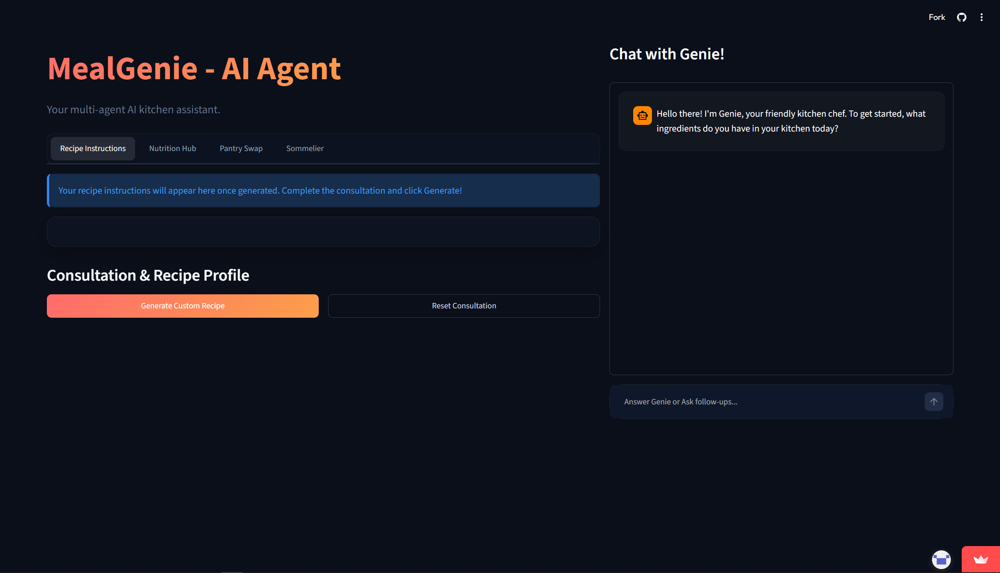
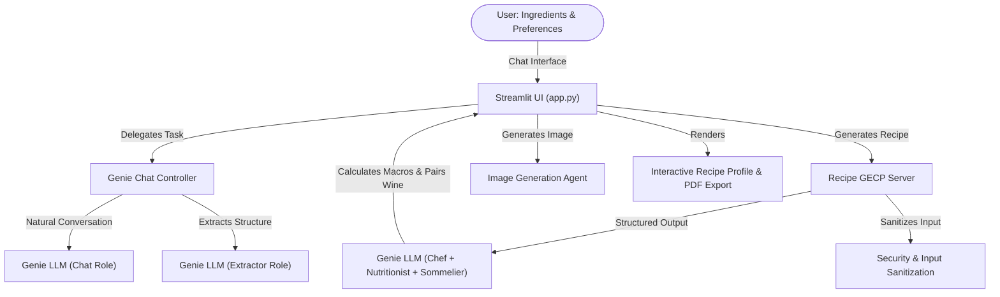

#  MealGenie: Your Personal AI Kitchen Concierge

<div align="center">
  
</div>

**Live App:** [Try MealGenie Here](https://mealgenieai.streamlit.app/)

## 📌 Track: Concierge Agents
**MealGenie** is submitted under the **Concierge Agents** track for the Kaggle Vibecoding Capstone Project. It serves as a personal AI assistant that streamlines daily meal planning, helping families solve the "what's for dinner" challenge while safely tracking dietary needs and allergies.

---

## 🚨 The Problem
Every day, households waste a massive amount of food simply because people don't know what to cook with the ingredients they already have. Furthermore, maintaining dietary restrictions, tracking nutrition, and finding the time to plan meals can be incredibly overwhelming. There is a strong need for a "concierge" service that can streamline this daily chore, reducing food waste and simplifying our lives.

## ✨ The Solution & Value
**MealGenie** is an agentic AI web application designed to act as your ultimate personal chef and kitchen manager. By chatting with the user or simply analyzing available ingredients, MealGenie provides a complete, personalized culinary experience. 

**Core Value Proposition:**
- **Reduces Food Waste**: Generates recipes based exactly on what's in the fridge.
- **Saves Time**: Instantly provides complete meal prep instructions, macros, and drink pairings.
- **Personalized & Safe**: Remembers allergies and diet restrictions, ensuring all recommendations are safe to consume.

---

## 🧩 Architecture

MealGenie orchestrates an AI workflow using the **LLM Orchestrator** pattern via Google's Gemini models. It uses Streamlit for a fluid frontend and interfaces with specialized AI personas in the backend.



---

## 🏆 Key Course Concepts Demonstrated (Evaluation Criteria)

This project applies several key concepts learned in the 5-Day AI Agents Intensive course:

### 1. Agent / Multi-Agent System (Code)
While traditional multi-agent systems use sequential LLM calls (which can be slow and expensive), MealGenie demonstrates an advanced **Single-Prompt Swarm Orchestration** pattern via Gemini's Structured Output (`genie_generate`). The agent is explicitly prompted to simultaneously adopt the roles of:
- **Chef**: To create the base recipe.
- **Safety Inspector**: To review against allergies.
- **Nutritionist**: To calculate macros.
- **Pantry Advisor**: To offer substitutes.
- **Sommelier**: To pair drinks.
- **Sustainability Expert**: To calculate carbon footprint.
This demonstrates advanced prompt engineering and agent persona management in code (`backend/agents/genie_agent.py`).

### 2. Security Features (Code)
Handling user input (ingredients, chat text) requires basic security to prevent injection or malicious inputs. MealGenie demonstrates this through its `utils/security.py` module, which exposes `sanitize_text` and `is_allowed_file`. All user inputs to the core generation engine pass through this sanitizer to prevent prompt injections (`backend/core/recipe_gecp_server.py`).

### 3. Deployability (Code & Video)
MealGenie is designed to be fully deployable as a cloud application. It utilizes Streamlit's secrets management framework (`st.secrets`) and provides a `requirements.txt`. It is structurally ready for **Streamlit Community Cloud** or containerization.

---

## 🚀 Installation & Setup

### 1. Clone the repository
```bash
git clone https://github.com/ktkubracom/MealGenie-AI-Agent.git
cd MealGenie-AI-Agent
```

### 2. Environment Setup
Create and activate a Python virtual environment:
```bash
python -m venv venv
# On macOS/Linux:
source venv/bin/activate
# On Windows:
venv\Scripts\activate
```

### 3. Install Dependencies
```bash
pip install -r requirements.txt
```

### 4. Configure Secrets
MealGenie uses Streamlit's secrets management for the API keys. Create a `.streamlit/secrets.toml` file in the root directory:
```toml
# .streamlit/secrets.toml
GEMINI_API_KEY = "your-gemini-api-key"
```

### 5. Run the Application locally
Start the Streamlit application:
```bash
streamlit run app.py
```
The application will open in your default browser at `http://localhost:8501`.

---

## 🛡️ Security Note
The `.streamlit/secrets.toml` file is excluded via `.gitignore`. **Never include any API keys or passwords in your submitted code.** The application relies on local environmental variables or Streamlit Secrets.

---
*Submitted for the Kaggle Vibecoding Capstone Project.*
